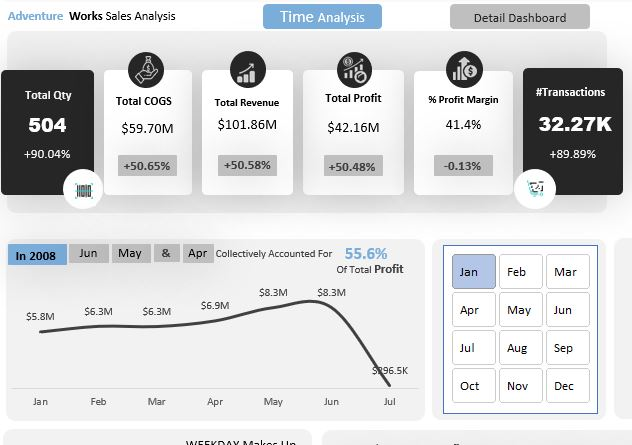

# Adventure-Work-Sales-Analysis
The project involved analyzing multiple tables imported into Excel, comprising data from sales transactions, customer details, product information, and geographical segments.

Project Overview:

The project involved analyzing multiple tables imported into Excel, comprising data from sales transactions, customer details, product information, and geographical segments. The primary objective was to extract precise insights to understand sales trends, customer behavior, and profitability across a four-year period (2005-2008).

Data Preparation Journey:

Data Refinement:

Fact Internet Sales table: Created custom columns - Total Revenue, Cost of Goods Sold, and Total Profit.
Removed unnecessary columns across various tables (Sales Territory, Product, Geography, Date, and Customer).
Cleansed data to ensure accuracy and consistency.
Establishing Relationships:

Employed Power Pivot to create connections between tables.
Fact Internet Sales served as the primary table, linked to other tables for comprehensive analysis.
Insights and Analysis:

Temporal Trends (Dashboard 1):

Revenue Analysis: From 2005 to 2008, average revenue was $76,773,236.
Profit Trends: Average profit during this period was $31,572,644.
Transaction Analysis: Average number of transactions was 15,100.
Yearly breakdowns:
2005 Insights:
Total Revenue: $33.37 Million
Total Profit: $13.40 Million
Total Transactions: 1.01K
2006 Insights:
Total Revenue: $64.48 Million
Total Profit: $28.18 Million
Total Transactions: 2.68K
2007 Insights:
Total Revenue: $102.38 Million
Total Profit: $42.55 Million
Total Transactions: 24.44K
2008 Insights:
Total Revenue: $101.86 Million
Total Profit: $42.16 Million
Total Transactions: 32.27K

Year-wise Detailed Analysis (Dashboard 2):
2005 Insights:

Top 5 Profitable Products: Contributed 77.6% of total profit.
Top 5 Profitable Customers: Contributed 1.1% of total profit.
Sold 581 out of 606 available products.
Average customer age: 44, total customers: 1,013.
Female gender profit margin: 48.5%, Male gender profit margin: 51.5%.
Profitable color: Red ($10.56 Million), Black ($1.60 Million), Silver ($1.25 Million).
Profit contribution by age group above 50: 48.5%.
2006 Insights:

Top 5 Profitable Products: Contributed 43.9% of total profit.
Top 5 Profitable Customers: Contributed 0.5% of total profit.
Sold 550 out of 606 available products.
Average customer age: 44, total customers: 2,677.
Female gender profit margin: 51.4%, Male gender profit margin: 48.6%.
Profitable color: Red ($16.36 Million), Black ($7.86 Million), Silver ($3.39 Million).
Profit contribution by age group above 50: 46.1%.
2007 Insights:

Top 5 Profitable Products: Contributed 34.9% of total profit.
Top 5 Profitable Customers: Contributed 0.5% of total profit.
Sold 473 out of 606 available products.
Average customer age: 44, total customers: 9,309.
Female gender profit margin: 50.5%, Male gender profit margin: 49.5%.
Profitable color: Black ($16.73 Million), Silver ($9.81 Million), Yellow ($7.30 Million).
Profit contribution by age group above 50: 45.2%.
2008 Insights:

Top 5 Profitable Products: Contributed 31.5% of total profit.
Top 5 Profitable Customers: Contributed 0.5% of total profit.
Sold 504 out of 606 available products.
Average customer age: 44, total customers: 11,377.
Female gender profit margin: 50.2%, Male gender profit margin: 49.8%.
Profitable color: Black ($12.97 Million), Yellow ($11.17 Million), Silver ($9.47 Million).
Profit contribution by age group above 50: 45.8%.
Conclusion:

Through meticulous data preparation, relational modeling, and in-depth analysis leveraging DAX, we uncovered intricate insights into sales dynamics, customer behavior, and profitability trends across a four-year period. The detailed breakdowns showcased how specific products, customer segments, demographics, and sales attributes contributed to overall profitability, empowering stakeholders with actionable insights for informed decision-making.
